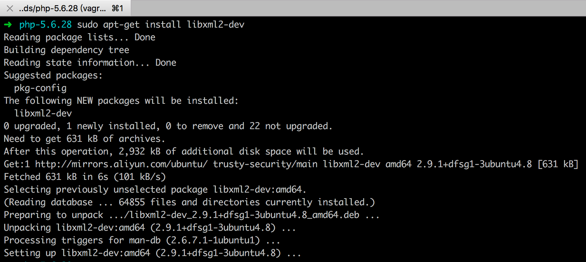
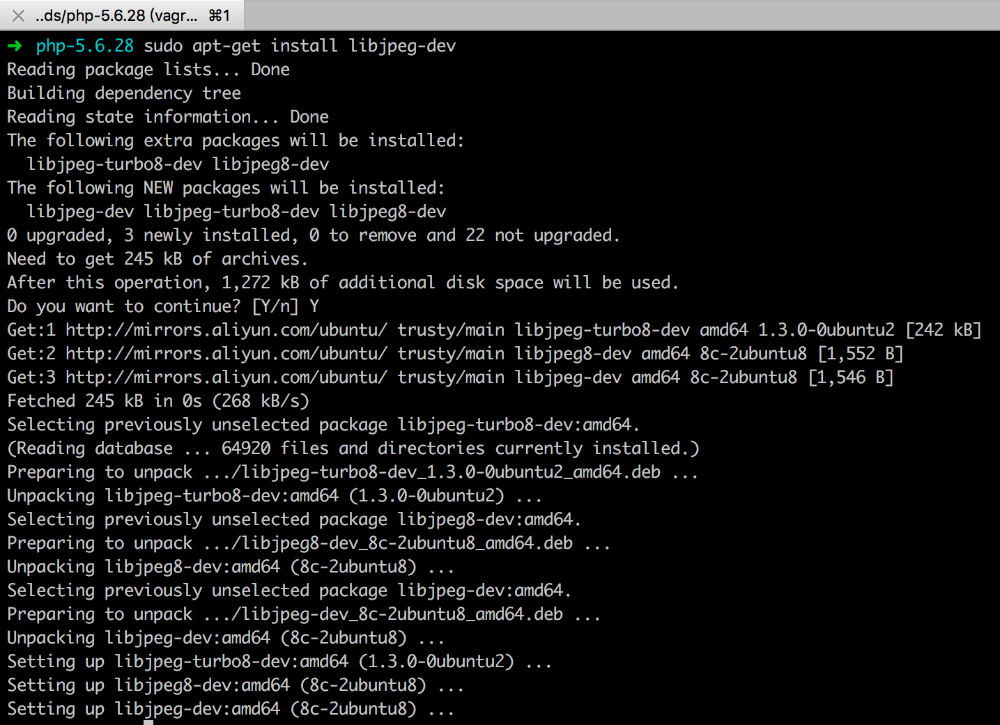
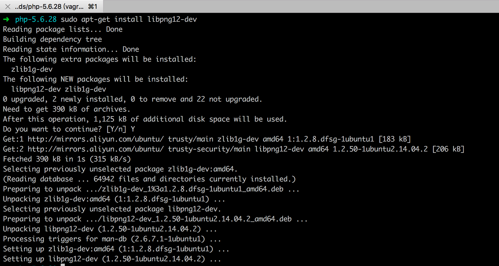
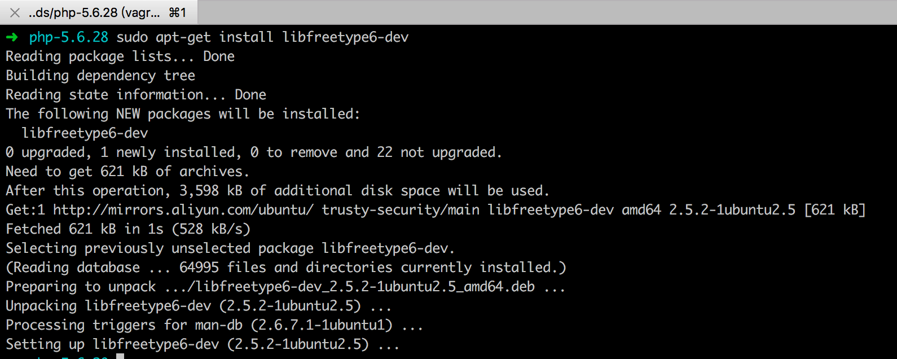
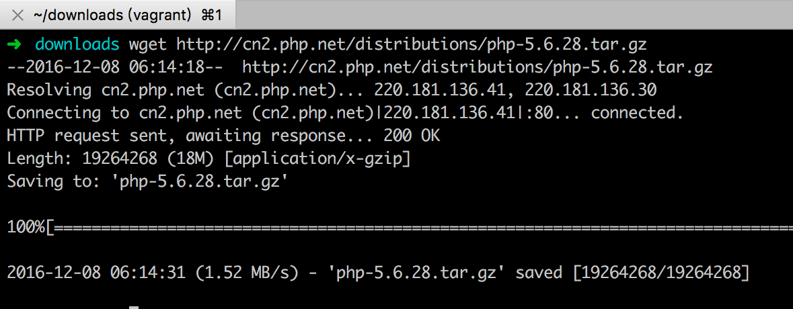
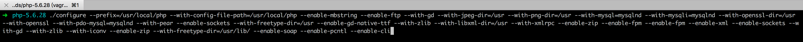
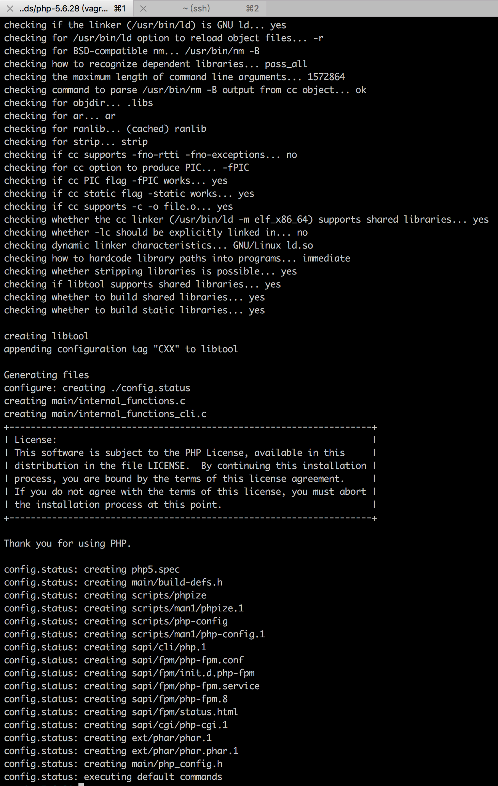
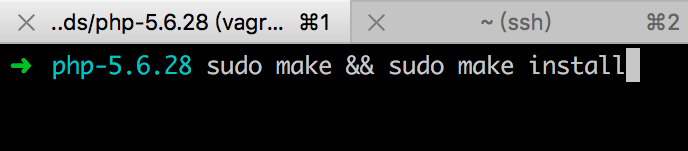
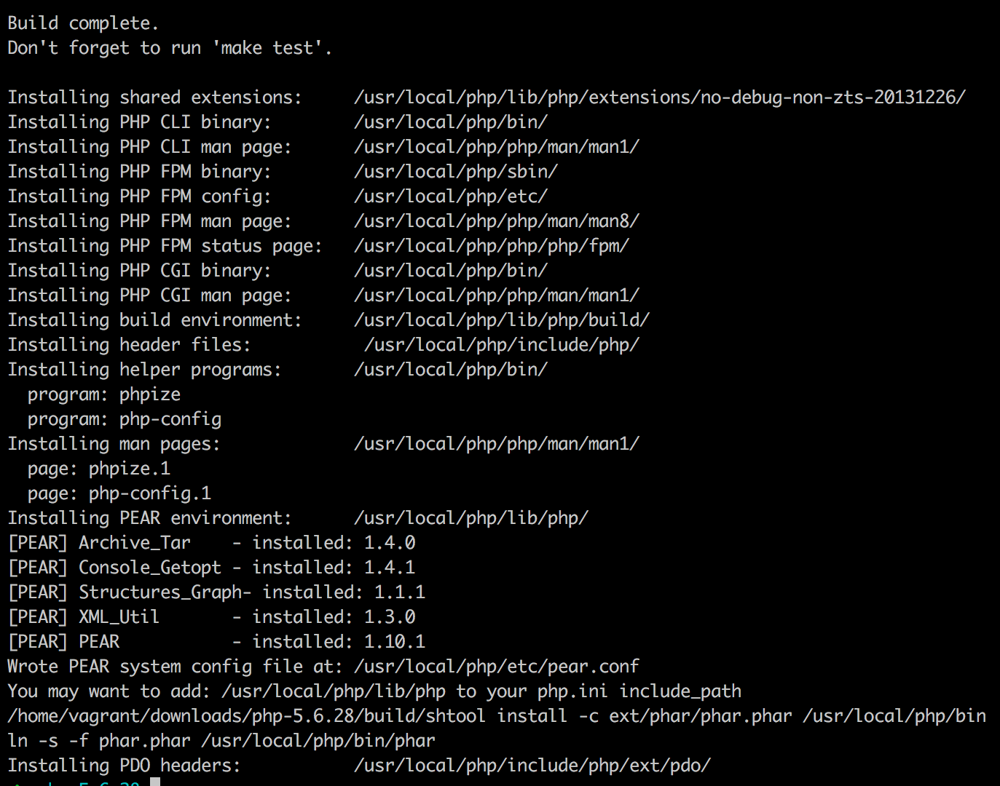

# Ubuntu 14.04 编译安装php5.6

### 0. 预装软件
```bash
sudo apt-get update

sudo apt-get install libxml2-dev
sudo apt-get install libjpeg-dev
sudo apt-get install libpng12-dev
sudo apt-get install libfreetype6-dev
sudo apt-get install libcurl4-openssl-dev
```









### 1. 下载PHP5.6.28源码
```bash
wget http://cn2.php.net/distributions/php-5.6.28.tar.gz
```



### 2. 解压并安装

- 安装路径：`/usr/local/php`

```bash
tar -zxf php-5.6.28.tar.gz
cd php-5.6.28
./configure --prefix=/usr/local/php --with-config-file-path=/usr/local/php --enable-mbstring --enable-ftp --with-gd --with-jpeg-dir=/usr --with-png-dir=/usr --with-mysql=mysqlnd --with-mysqli=mysqlnd --with-openssl-dir=/usr --with-openssl --with-pdo-mysql=mysqlnd --with-pear --enable-sockets --with-freetype-dir=/usr --enable-gd-native-ttf --with-zlib --with-libxml-dir=/usr --with-xmlrpc --enable-zip --enable-fpm --enable-fpm --enable-xml --enable-sockets --with-gd --with-zlib --with-iconv --enable-zip --with-freetype-dir=/usr/lib/ --enable-soap --enable-pcntl --enable-cli
```








